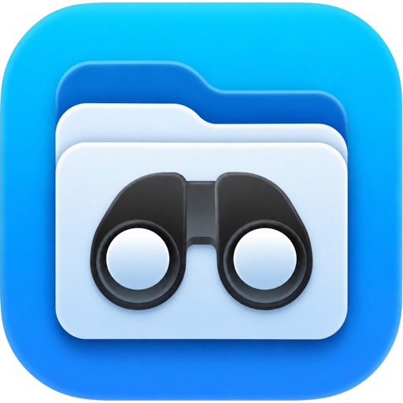

<div align="center">
  

# Folder Peek

### Preview folders and archives inside macOS Quick Look


</div>

Portuguese guide (primary): [README.pt-BR.md](./README.pt-BR.md)

## 📚 Index

- [About](#-about)
- [Project status](#-project-status)
- [Features](#-features)
- [Visual preview](#-visual-preview)
- [Project access](#-project-access)
- [Install and run](#-install-and-run)
- [Tech stack](#-tech-stack)
- [Architecture](#-architecture)
- [Roadmap](#-roadmap)
- [Contributing](#-contributing)
- [Author](#-author)
- [License](#-license)

## 🚀 About

**Folder Peek** is a free macOS app that extends Finder Quick Look with rich previews for folders and archive-like content. It helps developers and power users inspect structures quickly without opening multiple apps or extracting files manually.

## 📌 Project status

🟢 **Active / under continuous improvement**

- Current version: **1.3 (build 4)**
- Update channel: **Sparkle (stable)**

## 🔨 Features

### Main app (SwiftUI)

- Native macOS experience.
- Fast access to installed app and extension settings.
- Dedicated donation tab (PIX, QR code, copy action).
- Project PIX key: `d6d63f9b-5e12-4b96-8f33-d2b83a23e86d`.

### Temporary tray (Dropover/Yoink-style)

- Single floating tray window (no tabs) to hold multiple files temporarily.
- Clean grid layout focused on drag in / drag out.
- Automatic trigger when Finder file drag is detected.
- The tray opens attached to the right side of Finder whenever possible.
- Default global shortcut to show/hide: `Control + Option + Space`.
- V1 note: selecting multiple files without dragging does not auto-open the tray.

### Quick Look extension

- Folder preview directly inside Finder.
- Declared support for `public.directory`, `public.folder`, ZIP/TAR/GZIP/7z/RAR UTTypes.

### Shared core (`FolderPeekCore`)

- Finder-style table: name, kind, size, modified date, relative path.
- Safe central-directory reader for ZIP listing.
- Testable, reusable foundation for incremental improvements.

### Build and distribution

- One script for build, ad-hoc signing, `dist/` output, and `/Applications` install.
- Extension re-registration to reduce local validation friction.

## 🖼 Visual preview

<div align="center">
  
</div>

- Generated app bundle in repo: `dist/FolderPeek.app`
- Installed app path: `/Applications/FolderPeek.app`

## 🌐 Project access

- Repository: [github.com/alisoncardosoo/FolderPeek](https://github.com/alisoncardosoo/FolderPeek)
- Sparkle feed: [docs/sparkle/appcast.xml](./docs/sparkle/appcast.xml)
- Main local build command: `./script/build_and_run.sh`

## ⚙️ Install and run

### 1) Clone

```bash
git clone https://github.com/alisoncardosoo/FolderPeek.git
cd FolderPeek
```

### 2) Build + install

```bash
./script/build_and_run.sh
```

### 3) Manual install (optional)

1. Build app into `dist/FolderPeek.app`.
2. Copy it to `/Applications/FolderPeek.app`.
3. Open the app once.

### 4) Enable Quick Look extension

1. Open **System Settings**.
2. Go to **General > Login Items & Extensions > Quick Look**.
3. Enable **Folder Peek Quick Look Extension**.
4. In Finder, select a folder and press **Space**.

### 5) Run tests

```bash
xcodebuild -project FolderPeek.xcodeproj -scheme FolderPeekCore -configuration Debug CODE_SIGNING_ALLOWED=NO test
```

### 6) Use the temporary tray

1. In Finder, start dragging files to auto-open the tray.
2. Manual fallback: press `Control + Option + Space`.
3. Drop files into the tray.
4. Drag tray items into the destination Finder folder.
5. Only one tray instance is allowed at a time (no multiple tray windows/tabs).

### 7) In-app updates with Sparkle

- Feed is configured in `FolderPeek/Resources/Info.plist`.
- Daily automatic checks (`SUScheduledCheckInterval=86400`).
- Public key is configured via `SUPublicEDKey`.

One-time setup:

1. Generate Sparkle keys on your Mac:
   ```bash
   /Users/alisoncardoso/Library/Developer/Xcode/DerivedData/FolderPeek-djcatetzbxrspeaxlcoailknpaet/SourcePackages/artifacts/sparkle/Sparkle/bin/generate_keys --account folderpeek
   ```
2. Validate the generated public key:
   ```bash
   /Users/alisoncardoso/Library/Developer/Xcode/DerivedData/FolderPeek-djcatetzbxrspeaxlcoailknpaet/SourcePackages/artifacts/sparkle/Sparkle/bin/generate_keys --account folderpeek -p
   ```
3. Update `SUPublicEDKey` in `FolderPeek/Resources/Info.plist`.
4. Never ship placeholder keys (`REPLACE_WITH_SPARKLE_PUBLIC_ED25519_KEY`).
5. Keep private keys out of Git (local keychain or CI secret).

Release flow snippet:

```bash
/Users/alisoncardoso/Library/Developer/Xcode/DerivedData/FolderPeek-djcatetzbxrspeaxlcoailknpaet/SourcePackages/artifacts/sparkle/Sparkle/bin/sign_update --account folderpeek dist/FolderPeek.zip
/Users/alisoncardoso/Library/Developer/Xcode/DerivedData/FolderPeek-djcatetzbxrspeaxlcoailknpaet/SourcePackages/artifacts/sparkle/Sparkle/bin/generate_appcast dist
```

## 🧰 Tech stack

| Layer | Technologies |
|---|---|
| Desktop app | Swift, SwiftUI, AppKit |
| Finder preview | Quick Look Preview Extension |
| Shared core | FolderPeekCore (internal testable framework) |
| Build and packaging | xcodebuild, codesign, ditto, pluginkit |
| Updates | Sparkle |

## 🏗 Architecture

```text
📦 Folder Preview
 ┣ 📂 FolderPeek                       # macOS app (SwiftUI)
 ┣ 📂 FolderPeekQuickLookExtension     # Quick Look extension
 ┣ 📂 FolderPeekCore                   # Shared and testable core
 ┣ 📂 FolderPeekCoreTests              # Core tests
 ┣ 📂 script                           # Build/install scripts
 ┣ 📂 docs                             # Appcast and release docs
 ┗ 📂 dist                             # Generated app bundle
```

## 🛣 Roadmap

- [x] Folder preview in Finder
- [x] ZIP listing from shared core
- [x] Automated build/install workflow
- [x] Sparkle in-app updates
- [ ] Full screenshots/GIF walkthrough
- [ ] Fully automated CI release pipeline

## 🤝 Contributing

1. Fork this repository.
2. Create a descriptive branch: `feat/my-improvement`.
3. Commit with clear context.
4. Open a Pull Request with objective problem/solution notes.

Before opening a PR:

- Run local tests.
- Do not hardcode secrets.
- Keep each PR focused on one goal.

## 👤 Author

<div align="center">
  

**Alison Cardoso**

[GitHub](https://github.com/alisoncardosoo)
</div>

## 📄 License

This repository does not currently include a versioned `LICENSE` file.
Until explicitly defined, treat it as **all rights reserved** by the author.

---

<div align="center">
  Built to make file inspection on macOS faster with a native, clean Quick Look experience.
</div>
